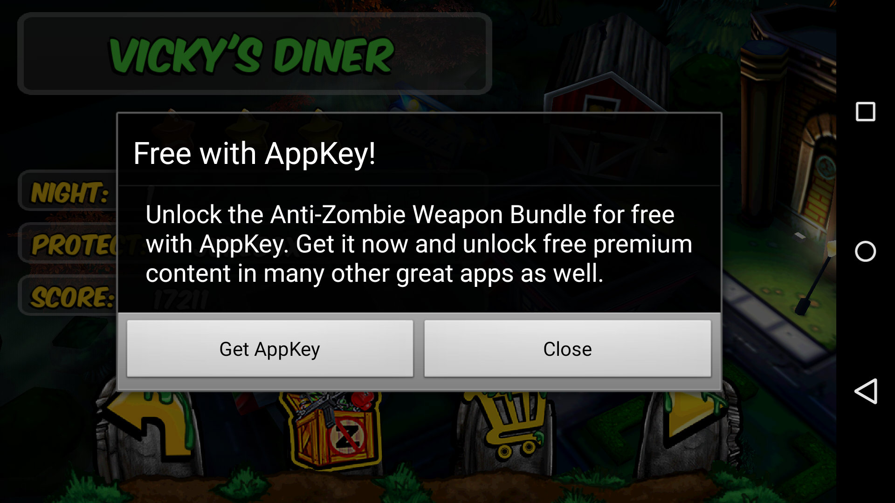
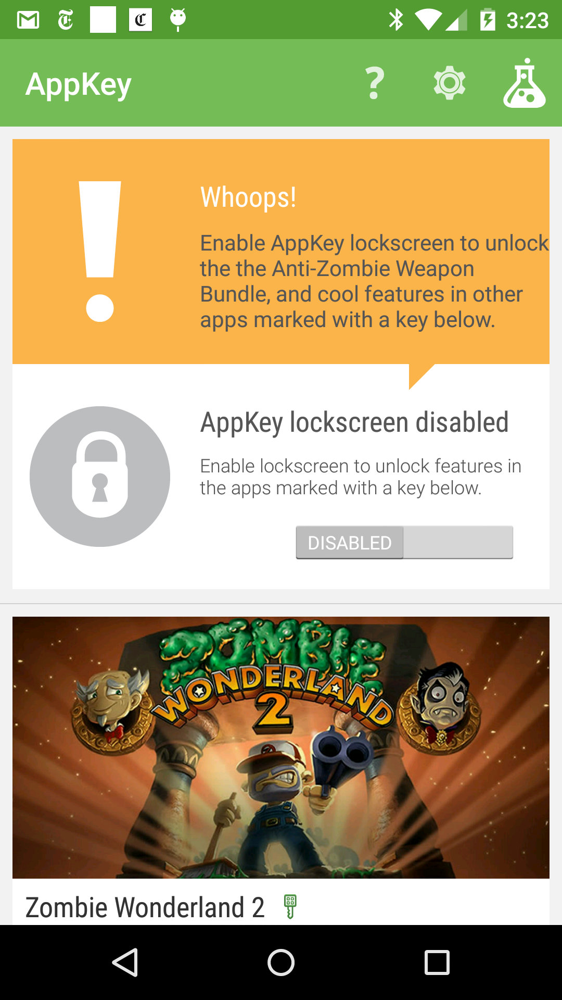

#AppKeySDKDemo

AppKeySDKDemo is a very simple AppKey integration example. This app detects the state of AppKey onResume() and updates the key to green if AppKey is enabled, red if not. Try switching away from the app to enable/disable the lockscreen and return to see the updated status.

Start the demo when AppKey is not installed on your test device, and follow the installation steps as suggested by promptUser to see the entire flow.

This project remains in eclipse format. Please contact us via contact@appkey.com with any questions or suggestions for other formats.

#License
This project is provided under a MIT open-source license. See LICENSE.md

#Getting Started
###1) Design your integration<br />
Determine the incentive users will receive when the lockscreen is enabled. A good incentive is generally: <br>
 a)	An existing item available via in-app-purchase<br>
 b)	Non-consumable<br>
 c)	Revocable (if user disables the lockscreen)<br>
###2)	Obtain a unique AppId from AppKey
###3)	Obtain the latest SDK (currently v1.7)

#Integration
###1) Include AppKeySdk-x-x.jar in your project<br />
###2) Instantiate AppKeyChecker<br />

```java
private AppKeyChecker mAppKeyChecker;
private String APP_ID = "7";  //Unique AppId assigned by AppKey

protected void onCreate(Bundle savedInstanceState) {
    ...
    mAppKeyChecker = new AppKeyChecker(this, APP_ID, true);
    ...
}
```
###3) Define a callback<br />

```java
class AppKeyCallback implements AppKeyCheckerCallback {

    @Override
    public void allow() {
        // Unlock the incentive here
    }

    @Override
    public void dontAllow(int i) {
        // Lock the incentive here
    }
}
```

###4) Call checkAccess<br />
Since the user can enable/disable the lockscreen outside of your app, we recommend calling
checkAccess from onResume to ensure the incentive lock/unlock status is kept current.<br />

```java
@Override
protected void onResume() {
    ...
    mAppKeyChecker.checkAccess(new AppKeyCallback());
    ...
}
```
###5) Pitch the user<br />
Let the user know there is an option to unlock content, similar to how you would prompt them
to make an in-app-purchase. When the user initiates action to learn more (butten click
or equivalent), you can either message them yourself with your own UI, or use the built-in
promptUser function:

```java
public void onClick(View v) {
    mAppKeyChecker.promptUser(this, "description of the incentive");
}
```
promptUser uses two UI’s depending on the state of the unlocker:

a) Unlocker not installed – default view:


This view uses a standard AlertDialog to prompt the user. The fields can be overridden with the following calls:

```java
public void onClickCustomText(View v) {
    mAppKeyChecker.setDialogTitle("Free with XYZ!");
    mAppKeyChecker.setDialogMessage("Unlock the %s for free with XYZ!...");
    mAppKeyChecker.setDialogPositiveButton("Get XYZ!");
    mAppKeyChecker.setPromptIcon(myIconDrawable);  //Icon shows on KitKat and below
    mAppKeyChecker.promptUser(this, "awesome thing");
}
```

b)	Unlocker installed, but lockscreen not enabled:
If the unlocker app is installed, but the lockscreen is not enabled, promptUser will launch
the unlocker using a special intent that shows the user exactly how to unlock their content:


#Feedback
We would love your feedback and/or improvements to this project - contact@appkey.com
